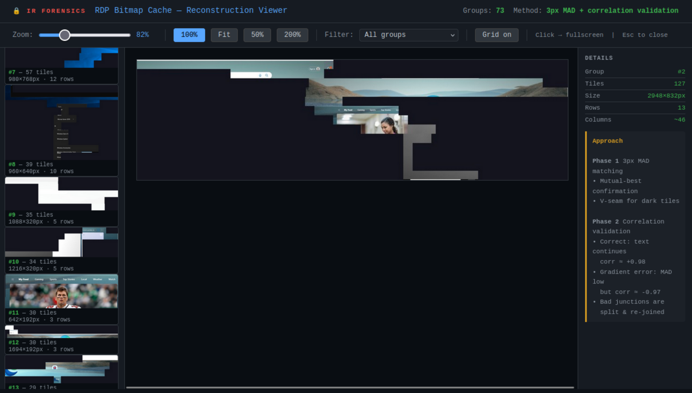
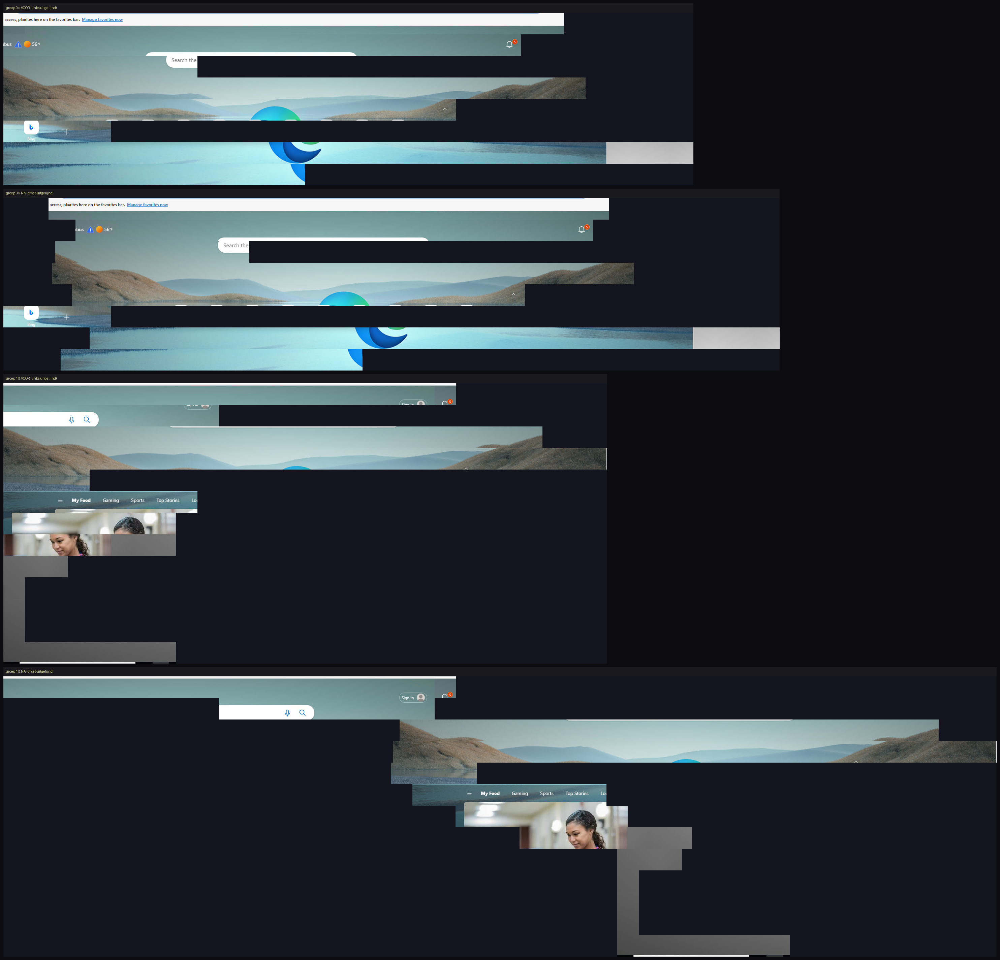
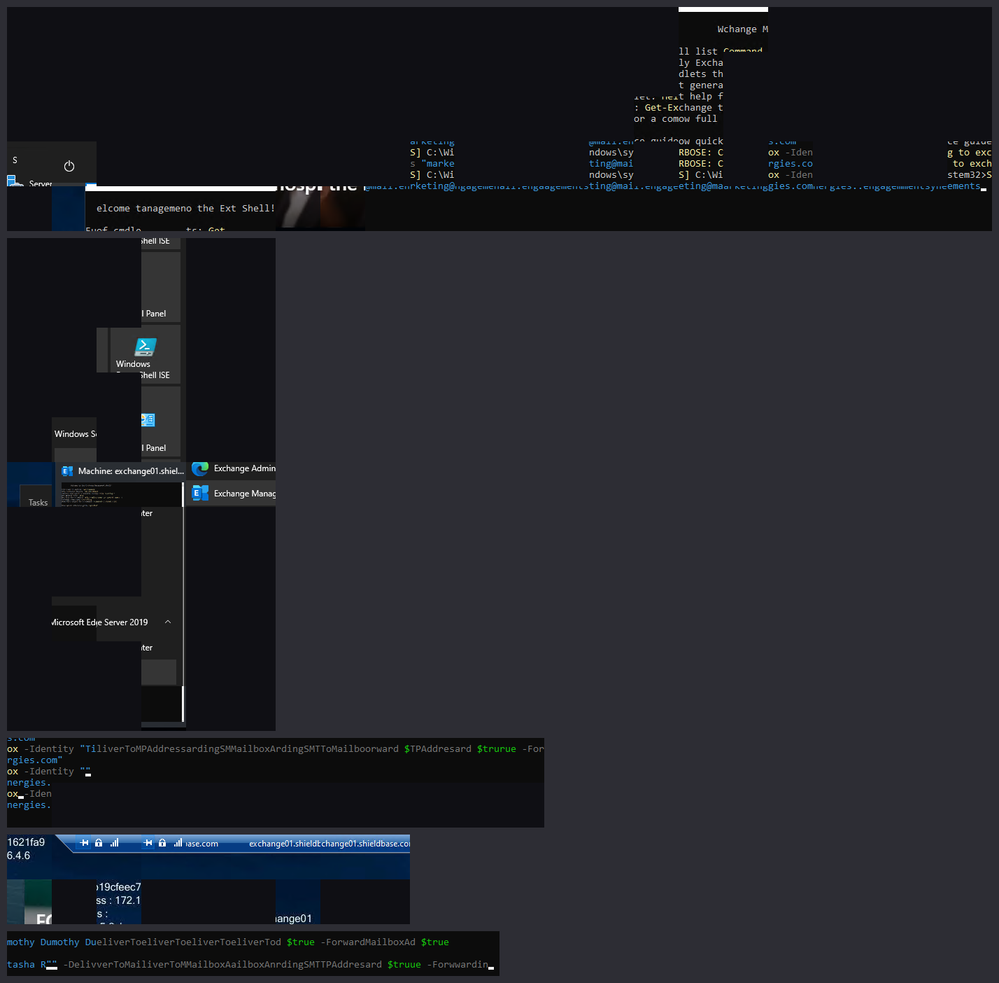
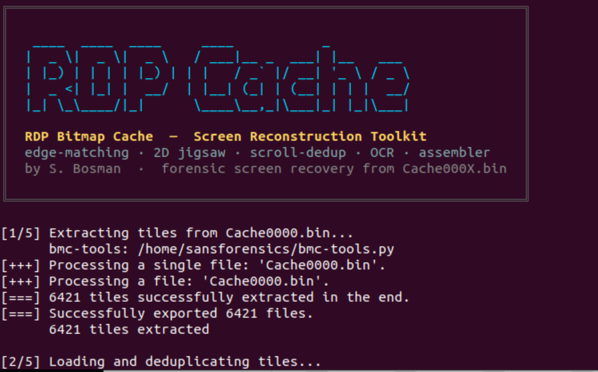
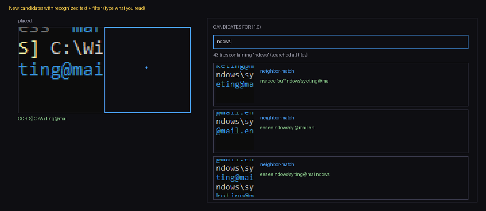

# RDP Bitmap Cache — Screen Reconstruction Toolkit

```
 ____  ____  ____     ____           _
|  _ \|  _ \|  _ \   / ___|__ _  ___| |__   ___
| |_) | | | | |_) | | |   / _` |/ __| '_ \ / _ \
|  _ <| |_| |  __/  | |__| (_| | (__| | | |  __/
|_| \_\____/|_|      \____\__,_|\___|_| |_|\___|
```

> *Rebuild what was on screen during an RDP session — from the cache it left behind.*

**Reconstruct on-screen content from the client-side RDP bitmap cache
(`Cache000X.bin`) — a digital-forensics toolkit.** It re-assembles the small
64×64 tiles the RDP client cached into larger, readable screen fragments —
windows, dialogs, the Start menu, and console/PowerShell output — and ships an
interactive assembler that lets you finish dense terminal text by hand, guided
by the machine.



---
## TL;DR
step 1:  
find “Cache0000.bin”, “Cache0001.bin”, etc in mounted triage image (.vhdx image)  
C:\Users\<USER>\AppData\Local\Microsoft\Terminal Server Client\Cache\  

step 2:  
pip install Pillow numpy  
pip install pytesseract  
git clone https://github.com/ANSSI-FR/bmc-tools.git  
cp bmc-tools/bmc-tools.py .  

step 3:  
use rdp_cache_reconstruct.py  
python rdp_cache_reconstruct.py Cache0000.bin --out ./rdp_output --top 60  

step 4 (optional)  
use the smart assembler  
python asm_build.py ./rdp_output/tiles  -o assembler_smart.html  

---

## Table of contents

- [Why this exists](#why-this-exists)
- [Features](#features)
- [How it works](#how-it-works)
- [Requirements](#requirements)
- [Workflow: triage → reconstruction](#workflow-triage--reconstruction)
- [Command-line options](#command-line-options)
- [Output](#output)
- [The interactive assembler](#the-interactive-assembler)
- [Limitations](#limitations)
- [Credits](#credits)
- [License](#license)

---

## Why this exists

The RDP client stores recently drawn screen regions as a flat cache of small
bitmap tiles so it can avoid re-sending unchanged areas. That cache survives on
disk and is a well-known forensic artifact: it can reveal **what an operator
actually saw** during a session — command output, file names, dialog text —
even when nothing else was logged.

The catch: the cache stores **no screen coordinates**. Tiles are kept in roughly
the order they were drawn, not where they belong on screen. So perfect automatic
reconstruction is impossible in general; the interesting work is getting as
close as possible and making the last mile easy for an analyst.

---

## Features

- **Tile extraction** from `Cache000X.bin` (via [bmc-tools](#credits)).
- **Edge-matching reconstruction** (Phase 1) with a correlation-based
  **validation / repair** pass (Phase 2) that detects and splits wrong joins.
- **Offset-aware row stacking** so reconstructed lines land at their true
  horizontal position instead of being left-aligned.
- **2D best-buddy "jigsaw" assembly** that grows coherent 2D regions by judging
  each tile against all of its placed neighbours at once — great for windows,
  dialogs, and menus.
- **Scroll / 2D de-duplication** that collapses tiles which are the same content
  captured at different scroll positions, reducing the repeated-column
  *"stutter"* in console text.
- **Dedicated terminal-text pass** tuned for dark console / PowerShell tiles.
- **Optional OCR transcript** (Tesseract) that flags forensically interesting
  lines (emails, hosts, commands, identities) into a searchable text file.
- **Interactive "smart" assembler** (`assembler_smart.html`): the machine
  proposes same-line candidates with their recognised text; you read and pick.
  Includes a filter that searches **all** tiles by recognised text.
- **Self-contained HTML viewer** to browse every reconstruction in the browser.

---

## How it works

**Phase 1 — Edge-matching.** Candidate neighbours are scored by a 3-pixel edge
MAD plus a mutual-best ("best-buddy") confirmation, so a join is only kept when
**both** tiles agree it is their best partner.

**Phase 2 — Correlation validation.** Each junction is re-checked with the
per-row brightness correlation across the seam. A correct join (text continues)
correlates strongly (≈ **+0.98**); a wrong join — e.g. a gradient/desktop tile
inserted by chance — can have a low MAD but a **negative** correlation. Bad
joins are split and a better candidate is searched.



**Terminal-text pass.** Console/PowerShell tiles are dark with thin text, where
plain MAD matches poorly (black matches black). This pass gates candidates on
**line registration** (per-row ink profiles must line up) before ranking by
seam colour, then builds chains and suppresses consecutive near-duplicates.

**2D jigsaw assembly.** Instead of building rows and stacking them (1D then 1D),
the jigsaw grows a 2D region and judges each new tile against **all** already
placed neighbours (left/right/above/below). A near-duplicate usually fits on one
edge but not the perpendicular one, so the joint agreement resolves much of the
ambiguity that 1D chains leave standing.



**Scroll de-duplication.** The same console line is cached at many scroll
positions as separate tiles, and those are each other's perfect neighbours,
which causes repeated columns. Tiles that are 2D shifts of one another are
merged — but **only when they are nearly pixel-identical**, so lines that merely
look alike in layout are *not* merged (no evidence is lost).

**The interactive assembler & OCR.** For dense console text, reliable pixel
matching can't tell which tile is the right continuation — only *reading* can
(`C:\Wi` + `ndows` = `Windows`). The smart assembler turns that into the
workflow: it offers same-line candidates, shows each one's OCR text, and lets
you filter all tiles by what you read. **The machine narrows the search; you
make the call.**

---

## Requirements

- **Python 3.8+**
- **Pillow** and **numpy** — `pip install Pillow numpy`
- **bmc-tools** next to the script for tile extraction (see [Credits](#credits))
- **Optional — OCR:** the **Tesseract** binary plus `pytesseract`
  (`pip install pytesseract`). On Debian/Ubuntu/SIFT:
  `sudo apt-get install tesseract-ocr`. Without it the tool simply skips
  OCR/transcripts and keeps running.

---

## Workflow: triage → reconstruction

### 1. Locate the RDP bitmap cache

Mount your forensic/triage image (`.vhdx`, `.E01`, …) **read-only** and browse
to the per-user cache folder:

```
C:\Users\<USER>\AppData\Local\Microsoft\Terminal Server Client\Cache\
```

You're looking for files named `Cache0000.bin`, `Cache0001.bin`, … (the RDP 8+
*"RDP8bmp"* format this tool targets). Older clients may instead store
`bcache22.bmc` / `bcache24.bmc`. **Work on copies**, keep the originals intact,
and record hashes for your documentation.

### 2. Set up

```bash
pip install Pillow numpy            # required
pip install pytesseract             # optional, enables OCR/transcripts

# tile-extraction back-end (placed next to this script)
git clone https://github.com/ANSSI-FR/bmc-tools.git
cp bmc-tools/bmc-tools.py .         # so rdp_cache_reconstruct.py can find it
```

For OCR, also install the Tesseract binary (e.g. `sudo apt-get install tesseract-ocr`).

### 3. Reconstruct

```bash
python rdp_cache_reconstruct.py Cache0000.bin --out ./output --top 60
```

Repeat per cache file if several exist, then open `output/viewer.html`. Add
`--jigsaw` for 2D window/menu assembly and `--assembler` for the interactive
terminal picker.

```bash
# 2D jigsaw assembly (better for windows / menus / dialogs)
python rdp_cache_reconstruct.py Cache0000.bin --out ./output --jigsaw

# generate the interactive assembler for the terminal tiles
python rdp_cache_reconstruct.py Cache0000.bin --out ./output --assembler

# OCR-transcribe an image you assembled yourself (e.g. a manual montage)
python rdp_cache_reconstruct.py --transcribe my_montage.png --out ./output
```



---

## Command-line options

| Option | Default | Description |
| --- | --- | --- |
| `bin_file` | – | Path to the RDP cache (`Cache000X.bin`). Optional in `--transcribe` mode. |
| `--out DIR` | `./rdp_output` | Output directory. |
| `--top N` | `60` | Number of reconstructed groups to export. |
| `--threshold F` | `18.0` | Edge-match MAD threshold (general tiles). |
| `--threshold-terminal F` | `28.0` | Edge-match MAD threshold (terminal tiles). |
| `--corr-threshold F` | `0.3` | Correlation threshold for junction validation. |
| `--no-align` | off | Left-align rows instead of using their true horizontal offset. |
| `--align-accept F` | `22.0` | Max seam MAD to trust a horizontal alignment. |
| `--no-terminal` | off | Skip the terminal-text pass. |
| `--term-top N` | `60` | Max number of terminal strips/blocks shown. |
| `--term-min N` | `2` | Min tiles per terminal strip. |
| `--no-ocr` | off | Do not generate an OCR transcript. |
| `--jigsaw` | off | 2D best-buddy assembly of the terminal tiles (extra blocks). |
| `--jigsaw-all` | off | 2D best-buddy assembly of **all** content tiles. |
| `--no-scroll-dedup` | off | Skip scroll/2D de-duplication before the jigsaw. |
| `--assembler` | off | Generate `assembler.html` (interactive tile picker). |
| `--transcribe IMAGE [IMAGE ...]` | – | Standalone OCR transcript of the given image(s). |
| `--preview-width N` | `920` | Preview width (px) in the HTML viewer. |
| `--no-viewer` | off | Do not write the HTML viewer. |
| `--no-banner` | off | Do not print the startup banner. |

> The banner uses colour only when writing to a real terminal and honours the
> `NO_COLOR` convention.

---

## Output

```
output/
├── viewer.html              # browse every reconstruction
├── groups/                  # exported reconstructed regions (PNG)
├── terminal/                # terminal-text strips & multi-line blocks
├── jigsaw_blocks/           # 2D jigsaw regions            (with --jigsaw)
├── assembler.html           # interactive tile picker      (with --assembler)
└── transcript.txt           # OCR transcript + flagged indicators (if OCR available)
```

---

## The interactive assembler

A separate, richer assembler can be generated for any extracted tile set:

```bash
python asm_build.py <tiles_dir> -o assembler_smart.html
```

It shows same-line candidates ranked by whether the text continues, prints each
candidate's recognised text, and lets you filter **all** tiles by text — so you
can type what you expect (e.g. `ndows`, `Mailbox`) and jump straight to it.
Build up the screen cell by cell and export the result as a PNG.



> **Note:** OCR text hints require Tesseract. Without it the assembler still
> works — just without the green hints and the text filter.

---

## Limitations

This tool is deliberately **honest about its ceiling**:

- **Structured UI** — windows, dialogs, menus, title bars — reconstructs well
  automatically, especially with `--jigsaw`.
- **Dense console / PowerShell output** is the hard case. Because the cache has
  no coordinates and adjacent text tiles share no overlapping pixels, **no
  purely pixel-based method can reliably pick the correct continuation of a
  line** — only reading the text can. Scroll-dedup and the terminal pass reduce
  the noise, but matching the quality of a careful manual reconstruction needs a
  human in the loop. That is exactly what the interactive assembler is for.
- **OCR quality depends on input quality.** On automatic strips the text can be
  partly garbled; on a clean (manual/assembled) montage the same OCR pass yields
  report-ready text — hence the `--transcribe` mode.


---

## Credits

- **Tile extraction** relies on **bmc-tools** by ANSSI-FR
  (<https://github.com/ANSSI-FR/bmc-tools>) — please observe its own licence.
- **OCR** uses **Tesseract** (<https://github.com/tesseract-ocr/tesseract>).
- Reconstruction, validation, jigsaw assembly, scroll-dedup, and the interactive
  assembler are part of this toolkit.

---

## License

This project's own code is released under the **MIT License** — see
[`LICENSE`](LICENSE). Note that **bmc-tools** carries its own (GPL) licence; it
is cloned separately and is **not** bundled here, so keep it credited and
unvendored.
